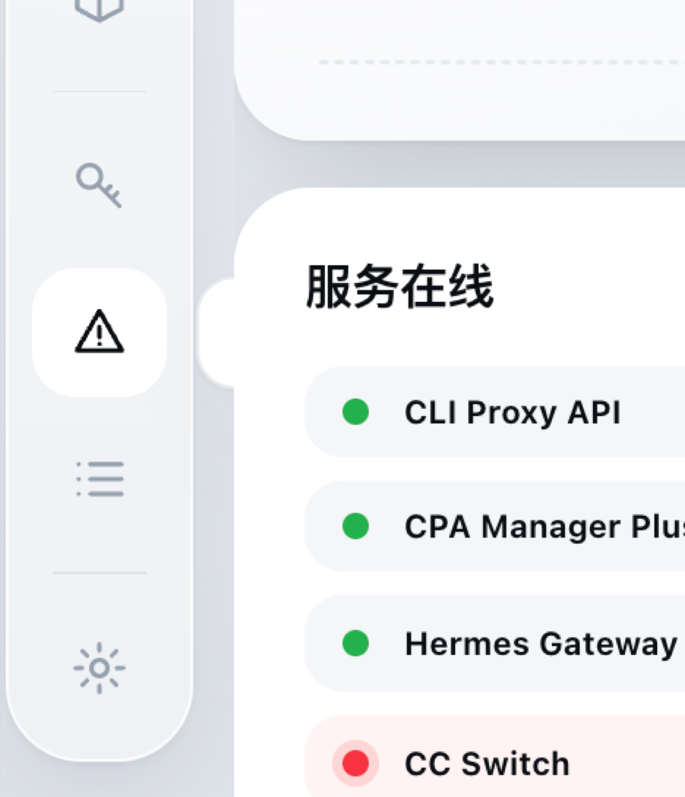

# FleetView

> **Local AI agent observability dashboard** — monitor services, proxy traffic, latency, tokens, accounts, and failures from one lightweight web UI.
>
> **本地 AI 智能体监控面板** —— 用一个轻量、易部署的 Web 界面统一查看服务状态、代理调用、首词延迟、Token、账号池与错误。

[English](#english) · [中文](#中文) · [Screenshots](#screenshots--截图)

<a id="screenshots--截图"></a>
## Screenshots / 页面截图



The screenshot shows the **Live Monitoring** view: a compact navigation rail, real-time throughput cards, service availability, and a request stream with model, provider, TTFT, total latency, token count, and result status.

截图展示的是**实时监控**页面：左侧紧凑导航栏、实时吞吐指标、服务在线状态，以及包含模型、供应商、首词延迟、总耗时、Token 数量和结果状态的调用流。

### Design overview / 页面设计说明

FleetView uses a restrained Apple-inspired operations-dashboard aesthetic rather than a decorative admin template:

- **Visual hierarchy** — the page title and live status are immediately visible; detailed request data stays in a dense but scannable table-like stream.
- **Compact navigation rail** — icon-first navigation keeps the monitoring workspace wide, while hover labels make every destination discoverable.
- **Glass and card surfaces** — translucent rail styling, soft borders, restrained shadows, and rounded cards separate controls from data without visual noise.
- **Live status language** — static status dots, clear labels, and success/error tags communicate state without distracting pulse animations.
- **Information density** — throughput, TTFT, token volume, service health, and recent calls are grouped into quick-glance modules for operators.
- **Dark/light themes** — CSS variables drive both themes consistently; the preference is saved locally in the browser.
- **Local-first interaction** — the dashboard is designed for a localhost control room, with readable states and explicit operational controls.

FleetView 采用克制的 Apple 风格运营面板设计，而不是堆砌装饰的后台模板：

- **视觉层级清晰**：标题和实时状态优先呈现，详细调用信息以紧凑、易扫描的流式列表展示。
- **紧凑导航栏**：默认只显示图标，保留更大的工作区；鼠标悬浮时显示文字提示，保证可发现性。
- **玻璃与卡片层次**：半透明侧栏、柔和边框、克制阴影和圆角卡片，让控件与数据自然分层。
- **状态表达直接**：使用静态状态点、明确文案和成功/失败标签，不用干扰注意力的呼吸灯动画。
- **高信息密度**：吞吐、首词延迟、Token、服务健康和最近调用集中在几个快速浏览模块中。
- **深色/浅色双主题**：通过 CSS 变量统一驱动，主题偏好保存在浏览器本地。
- **本地优先交互**：面向 localhost 控制台设计，状态明确，运维控制入口显式可见。


## English

FleetView is a self-hosted monitoring dashboard for developers and operators running local AI gateways, coding agents, model relays, and supporting services.

It is intentionally simple: Python standard library on the backend, vanilla JavaScript on the frontend, no cloud dependency, no build step, and no third-party runtime package required.

### Highlights

- **Service matrix** — HTTP, TCP, Unix socket, and process checks
- **Operational controls** — optional start/stop/restart controls through explicit local configuration
- **Live call stream** — Server-Sent Events (SSE) with polling fallback
- **Latency observability** — TTFT/P50/P90/P95, histograms, and model comparisons
- **Token and request analytics** — model/provider/account breakdowns
- **Failure analysis** — status codes, error concentration, and upstream clues
- **Dark and light themes** — responsive, compact sidebar navigation
- **Privacy-first by default** — binds to `127.0.0.1`; local databases are read-only sources
- **No frontend build chain** — static assets can be served directly

### Quick start

```bash
git clone https://github.com/YOUR_GITHUB_USERNAME/fleetview.git
cd fleetview
cp config.example.json config.json
./start.sh
```

Open <http://127.0.0.1:8790>.

Stop it with `./stop.sh`.

### Data sources

FleetView can read local usage data from CPA Manager Plus, CC Switch, and Hermes when those files exist. These are optional integrations; service health monitoring works without them. Personal paths, credentials, databases, and logs are intentionally excluded from this repository.

### Configuration and security

Edit `config.json` to add services. Only set `controllable: true` for commands you explicitly trust. FleetView is designed for local use and includes control endpoints: **do not expose it to the public internet without adding authentication and a carefully designed access layer**.

### Project structure

```text
server.py             HTTP server, API routes, polling loop
fleet/probe.py        Service probes, process checks, controls, health history
fleet/usage.py        Optional usage aggregation
static/               Vanilla JS, CSS, SVG icons, and views
config.example.json   Safe configuration template
start.sh / stop.sh    Local lifecycle scripts
```

### Requirements

- macOS, Linux, or Windows with Python 3.10+
- No pip installation required for the core dashboard
- Optional integrations require the corresponding local database files

### License

MIT. See [LICENSE](LICENSE).

<a id="中文"></a>
## 中文

FleetView 是一个面向开发者和运维人员的本地 AI 监控面板，适合监控本机 AI 网关、编程 Agent、模型中转服务以及相关基础服务。

它追求轻量和可控：后端使用 Python 标准库，前端使用原生 JavaScript，无云端依赖、无构建步骤、无第三方运行时依赖，克隆后即可启动。

### 主要功能

- **服务矩阵**：支持 HTTP、TCP、Unix Socket 和进程探测
- **启停控制**：通过本地配置显式开启服务启动、停止、重启
- **实时调用流**：SSE 长连接推送，不支持时自动降级为轮询
- **延迟分析**：首词延迟、P50/P90/P95、分布图和模型对比
- **调用与 Token 分析**：按模型、供应商、账号查看调用情况
- **错误分析**：状态码、失败集中度和上游问题线索
- **深色/浅色主题**：紧凑侧栏与响应式布局
- **隐私优先**：默认只绑定 `127.0.0.1`，本地数据库只读
- **免构建前端**：静态文件直接运行，不需要 Node.js

### 快速启动

```bash
git clone https://github.com/YOUR_GITHUB_USERNAME/fleetview.git
cd fleetview
cp config.example.json config.json
./start.sh
```

然后打开 <http://127.0.0.1:8790>，停止服务执行 `./stop.sh`。

### 数据来源

如果本机存在对应文件，FleetView 可以读取 CPA Manager Plus、CC Switch 和 Hermes 的本地数据。它们都是可选集成，没有这些文件时，服务健康检查仍可正常使用。个人路径、密钥、数据库和运行日志不会提交到仓库。

### 配置与安全

复制 `config.example.json` 为 `config.json` 后添加自己的监控项。只有确认命令安全、可信时，才设置 `controllable: true`。

面板包含本地服务控制接口，因此**不要在没有认证和访问控制的情况下暴露到公网**。

### 项目结构

```text
server.py             HTTP 服务、API 路由、轮询线程
fleet/probe.py        服务探测、进程检查、启停控制、健康历史
fleet/usage.py        可选的调用量与延迟聚合
static/               原生 JS、CSS、SVG 图标和页面视图
config.example.json   不含个人路径的安全配置模板
start.sh / stop.sh    启停脚本
```

### 环境要求

- macOS、Linux 或 Windows，Python 3.10+
- 核心面板无需安装 pip 依赖
- 可选数据分析功能需要对应的本地数据库文件

### 开源协议

MIT，详见 [LICENSE](LICENSE)。欢迎提交 Issue 和 Pull Request，请尽量附上问题描述、复现步骤、运行环境以及最小改动方案。

## Contributing / 参与贡献

Issues and pull requests are welcome. Please explain the problem, reproduction steps, environment, and the smallest useful change. 欢迎大家一起改进这个项目。

## Contributors / 贡献者

- **chunshinglee** — Project owner and maintainer
- **Claude** — AI development collaborator
